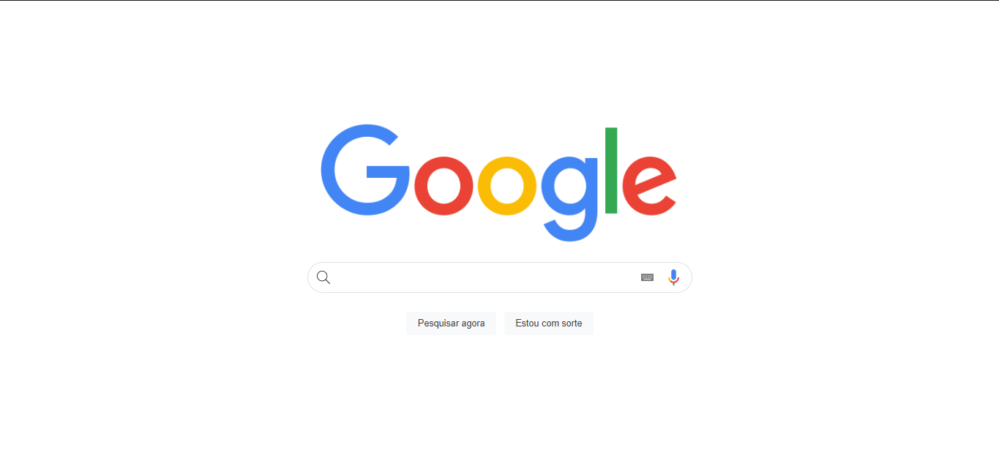

<h1 align="center">🔍 Tela da barra de busca do google 🔍</h1>

<h1 align="center">
    
</h1>

<h4 align="center"> 
Tela da barra de busca do google</h4>

 <a href="#-tecnologias">Tecnologias</a> 

## 💻 Sobre o projeto

🔍 Tela da barra de busca do google  

## 🛠 Tecnologias

As seguintes ferramentas foram usadas na construção do projeto:

#### **Layout**

- **[HTML](https://www.w3schools.com/html/)**
- **[CSS](https://www.w3schools.com/css/)**

#### **Utilitários**

- **CodePen: [TigerCodes](https://codepen.io/tigercodes)**
- **Editor: [Visual Studio Code](https://code.visualstudio.com/)**
- **Markdown: [StackEdit](https://stackedit.io/)**, **[Markdown Emoji](https://gist.github.com/rxaviers/7360908)**
- 🖥️ **Auxilio:** [TigerCodes Instagram](https://www.instagram.com/tiger_codes/);
- 👩‍💻 **Codigo base:** [TigerCodes CodePen](https://codepen.io/tigercodes/pen/bGWwLJQ); 

